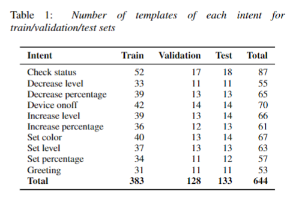
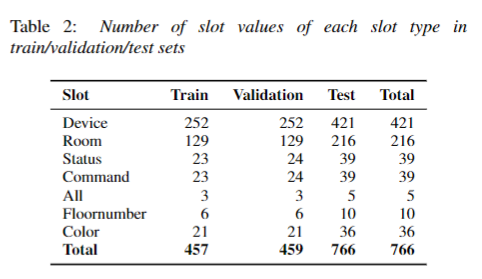
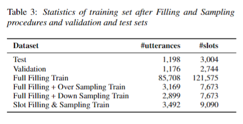

# Building Vietnamese Conversational Smart Home Dataset and Natural Language Understanding Model
 
- We introduce a public intent detection and slot filling dataset for Vietnamese.
- The scenario we chose to build the dataset was conversations between a smart home system and its owner.
- The data were cleaned then processed to build set of user request templates as well as that of slot values. 
- Many data generating and sampling techniques were examined to choose the most suitable one to create actual utterances from these 2 sets.

	

	

	

**Please CITE** our paper whenever our dataset is used to help produce published results or incorporated into other software.
    <!-- @inproceedings{
        title     = {{Building Vietnamese Conversational Smart Home Dataset and Natural Language Understanding Model}},
        author    = {Nguyen Thi Thu Trang and Dang Trung Duc Anh and Vu Quoc Viet and Park Woomyoung},
        booktitle = {Proceedings of the 23rd Annual Conference of the International Speech Communication Association (INTERSPEECH)},
        year      = {2022}
    } -->